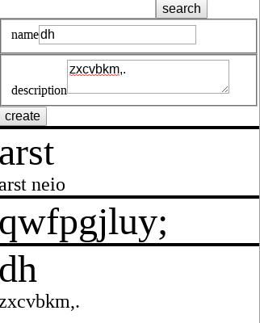

# resourceful

manage personal inventory



## get started

```sh
git clone git@github.com:ahdinosaur/resourceful
cd resourceful
npm run db migrate:latest
npm start
```

## stories

- when i want to add a new resource (from the "inbox"),
  - [x] i can add to my resources
- when i'm looking for a resource,
  - [ ] i can search my resources by name, description, category
- when i use / move a resource,
  - [ ] i can update my resources
- when i want to purge resources,
  - [ ] i can remove from my resources
  - [ ] i can see what i haven't updated, searched, or viewed in the last year

## license

The Apache License

Copyright &copy; 2017 Michael Williams

Licensed under the Apache License, Version 2.0 (the "License");
you may not use this file except in compliance with the License.
You may obtain a copy of the License at

    http://www.apache.org/licenses/LICENSE-2.0

Unless required by applicable law or agreed to in writing, software
distributed under the License is distributed on an "AS IS" BASIS,
WITHOUT WARRANTIES OR CONDITIONS OF ANY KIND, either express or implied.
See the License for the specific language governing permissions and
limitations under the License.
